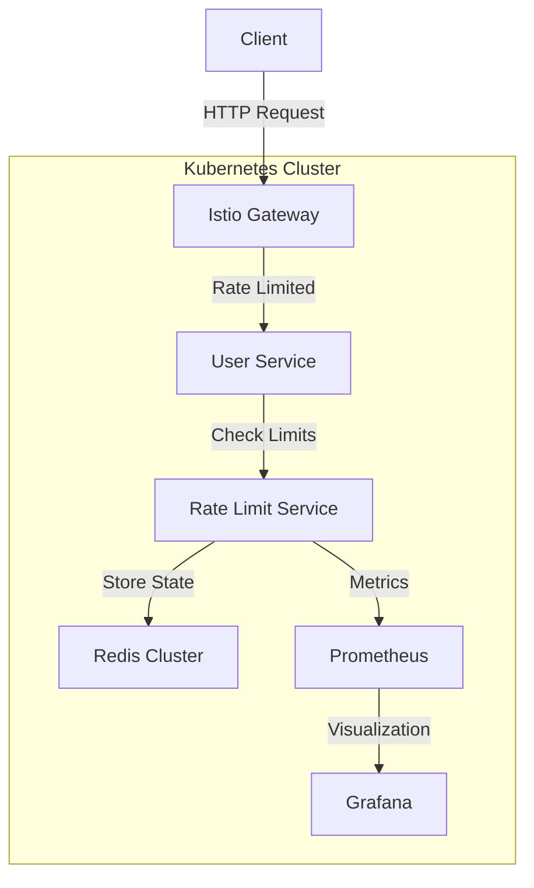

# Istio Rate Limiter Documentation

## Documentation Structure

1. [Overview](00-overview.md) - Project introduction and documentation structure
2. [Architecture](01-architecture.md) - System architecture and component interaction
3. [Prerequisites](02-prerequisites.md) - Required tools and environment setup
4. [Installation](03-installation.md) - Step-by-step installation guide
5. [Rate Limiting](04-rate-limiting.md) - Rate limiting concepts and implementation
6. [Configuration](05-configuration.md) - Detailed configuration options
7. [Load Testing](06-load-testing.md) - Testing guide and load testing tools
8. [Monitoring](07-monitoring.md) - Monitoring and observability
9. [Troubleshooting](08-troubleshooting.md) - Common issues and solutions
10. [API Reference](09-api-reference.md) - API documentation

## Project Overview

This project demonstrates implementing rate limiting in a Kubernetes environment using Istio service mesh. It showcases a robust implementation of service-level rate limiting with multiple strategies.

### System Architecture



### Key Features

1. **Multi-level Rate Limiting**
   - IP-based rate limiting
   - Company-based rate limiting using JWT tokens
   - Global rate limiting across services

2. **Distributed Architecture**
   - Redis cluster for distributed rate limit storage
   - High availability setup
   - Scalable components

3. **Advanced Features**
   - JWT-based authentication
   - Real-time monitoring and metrics
   - Load testing capabilities
   - Configurable rate limits

4. **Observability**
   - Prometheus metrics
   - Grafana dashboards
   - Distributed tracing
   - Detailed logging

### Project Structure

```
istio-rate-limiter/
├── docs/               # Documentation
├── user-service/       # Sample service implementation
├── rate-limit-service/ # Rate limiter implementation
├── k8s/               # Kubernetes configurations
├── loadtest/          # Load testing tools
└── monitoring/        # Monitoring configurations
```

### Getting Started

To get started with the project, follow these documents in sequence:

1. Check the [Prerequisites](02-prerequisites.md) for required tools and environment
2. Follow the [Installation](03-installation.md) guide for setup
3. Understand [Rate Limiting](04-rate-limiting.md) concepts
4. Configure using [Configuration](05-configuration.md)
5. Test using [Load Testing](06-load-testing.md)

For any issues, refer to the [Troubleshooting](08-troubleshooting.md) guide.

## Official Documentation References

### Istio
- [Istio Documentation](https://istio.io/latest/docs/)
- [Istio Rate Limiting](https://istio.io/latest/docs/tasks/policy-enforcement/rate-limit/)
- [Istio Security](https://istio.io/latest/docs/concepts/security/)
- [Istio Observability](https://istio.io/latest/docs/concepts/observability/)

### Kubernetes
- [Kubernetes Documentation](https://kubernetes.io/docs/)
- [Kubernetes Security](https://kubernetes.io/docs/concepts/security/)
- [Kubernetes Networking](https://kubernetes.io/docs/concepts/services-networking/)

### Redis
- [Redis Documentation](https://redis.io/documentation)
- [Redis Cluster](https://redis.io/topics/cluster-tutorial)
- [Redis Rate Limiting](https://redis.io/topics/rate-limiting)

### Monitoring
- [Prometheus Documentation](https://prometheus.io/docs/)
- [Grafana Documentation](https://grafana.com/docs/)
- [OpenTelemetry](https://opentelemetry.io/docs/)

## Performance Considerations

### Istio Overhead
- Sidecar proxy adds ~10ms latency per hop
- Memory usage: ~50MB per pod
- CPU usage: ~0.1 cores per pod
- Network overhead: ~1.5x bandwidth

### Rate Limiting Performance
- Redis cluster handles 100k+ requests/second
- JWT validation adds ~1ms latency
- Rate limit checks add ~2ms latency
- Circuit breaking prevents cascading failures

### Production Checklist
- [ ] Monitor sidecar resource usage
- [ ] Configure appropriate resource limits
- [ ] Set up horizontal pod autoscaling
- [ ] Implement circuit breakers
- [ ] Configure retry policies
- [ ] Set up proper monitoring
- [ ] Enable distributed tracing
- [ ] Configure appropriate timeouts

### Support and Contribution

For support:
- Create an issue in the GitHub repository
- Check the troubleshooting guide
- Review existing issues

For contribution:
- Fork the repository
- Create a feature branch
- Submit a pull request
- Follow the contribution guidelines

### License

This project is licensed under the MIT License - see the LICENSE file for details. 