# Architecture

## System Overview

The Istio Rate Limiter is built on a microservices architecture using Kubernetes and Istio service mesh. The system consists of several key components working together to provide robust rate limiting capabilities.

### High-Level Architecture

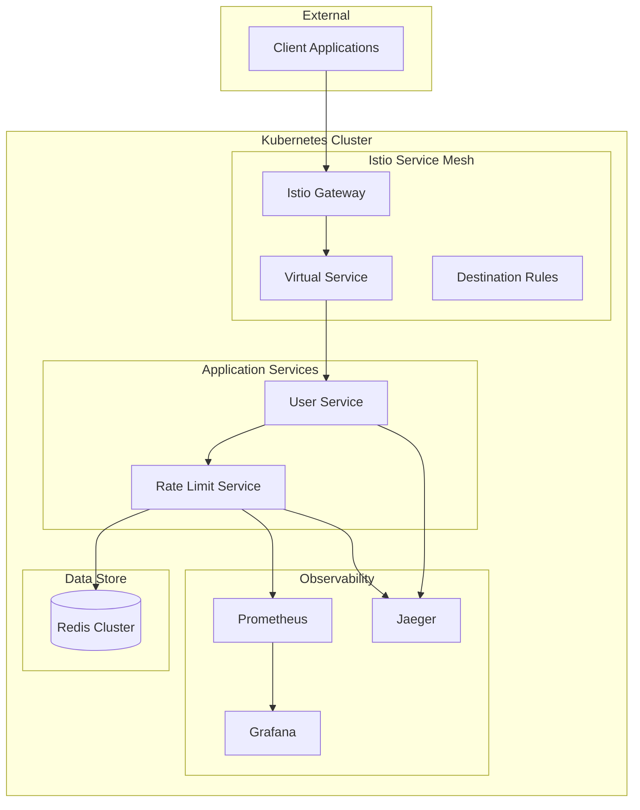

## Component Details

### 1. Istio Service Mesh Layer

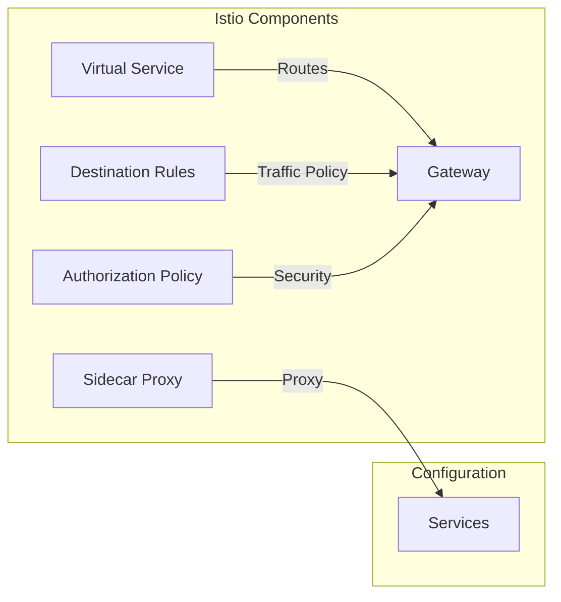

#### Key Components:
- **Istio Gateway**: Entry point for external traffic
- **Virtual Service**: Traffic routing rules
- **Destination Rules**: Traffic policies
- **Authorization Policy**: Security rules
- **Sidecar Proxy**: Request/response handling

### 2. Application Services

#### User Service
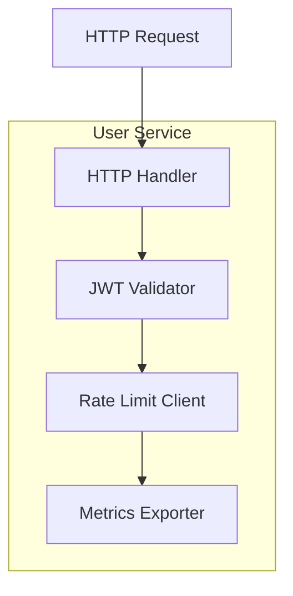

#### Rate Limit Service
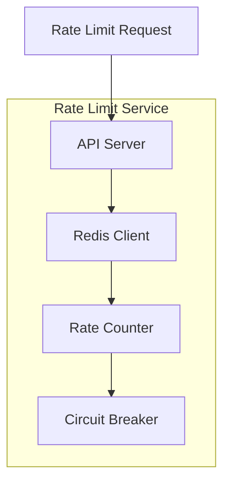

### 3. Data Flow

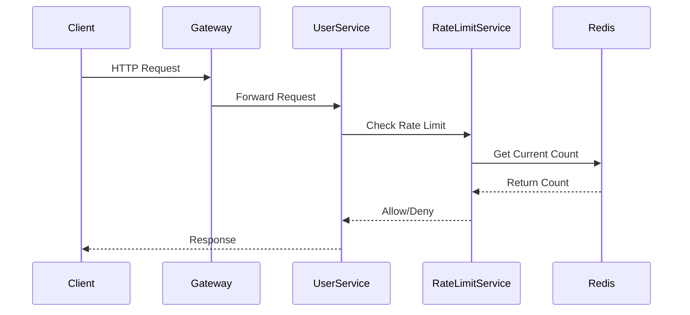

## Technical Specifications

### 1. Service Mesh Configuration

#### Gateway Configuration
```yaml
apiVersion: networking.istio.io/v1alpha3
kind: Gateway
metadata:
  name: user-service-gateway
spec:
  selector:
    istio: ingressgateway
  servers:
  - port:
      number: 80
      name: http
      protocol: HTTP
    hosts:
    - "*"
```

#### Virtual Service Configuration
```yaml
apiVersion: networking.istio.io/v1alpha3
kind: VirtualService
metadata:
  name: user-service-vs
spec:
  hosts:
  - "*"
  gateways:
  - user-service-gateway
  http:
  - route:
    - destination:
        host: user-service
        port:
          number: 8080
```

### 2. Rate Limiting Implementation

#### Rate Limit Algorithm
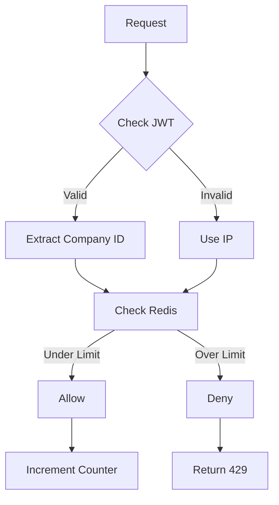

### 3. Monitoring Architecture

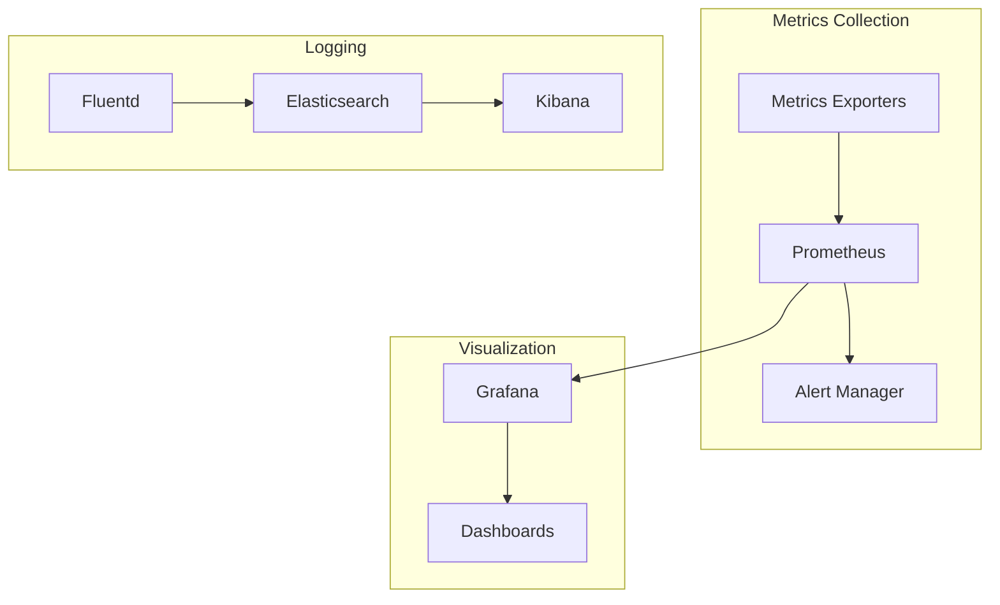

## Security Architecture

### 1. Authentication Flow

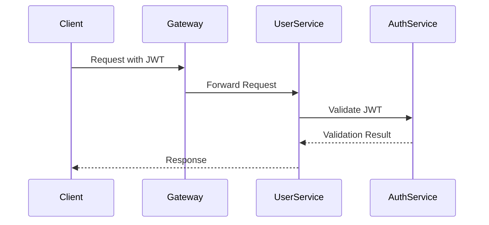

### 2. Network Security

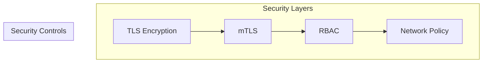

## Deployment Architecture

### 1. Kubernetes Resources

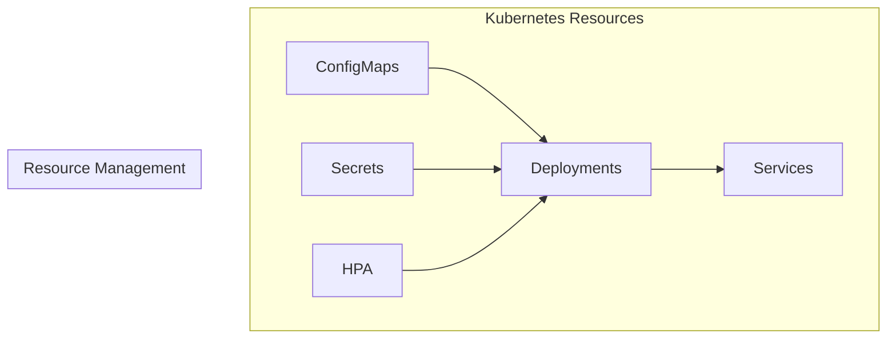

### 2. Scaling Strategy

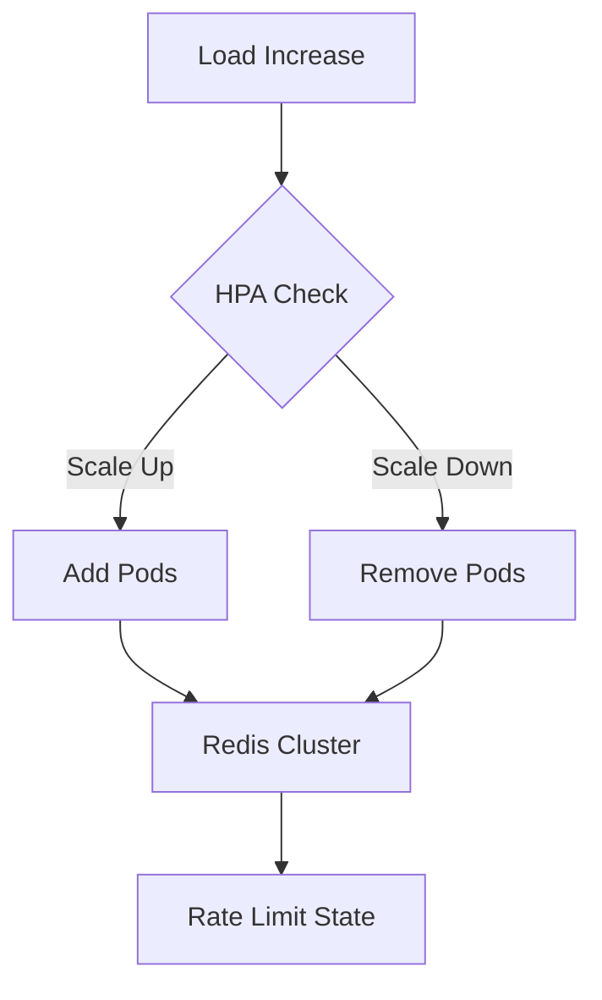

## Performance Considerations

### 1. Resource Requirements

| Component | CPU | Memory | Storage |
|-----------|-----|---------|----------|
| User Service | 0.5 CPU | 512Mi | N/A |
| Rate Limit Service | 1 CPU | 1Gi | N/A |
| Redis Cluster | 2 CPU | 2Gi | 10Gi |
| Prometheus | 1 CPU | 2Gi | 50Gi |
| Grafana | 0.5 CPU | 512Mi | 5Gi |

### 2. Performance Metrics

- Request Latency: < 100ms (P95)
- Rate Limit Checks: < 10ms
- Redis Operations: < 5ms
- JWT Validation: < 2ms

## High Availability

### 1. Component Redundancy

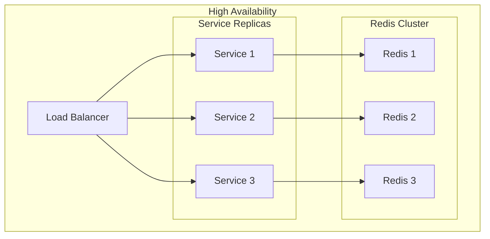

### 2. Failure Scenarios

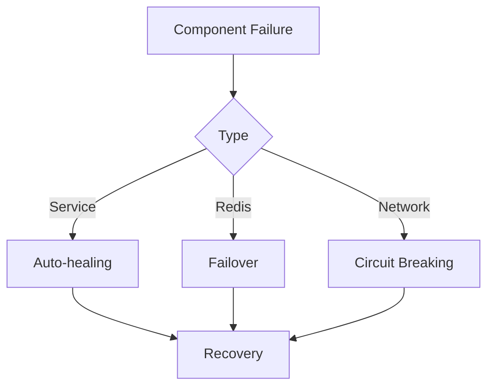

## Development Workflow

### 1. CI/CD Pipeline

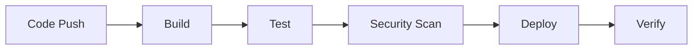

### 2. Environment Strategy

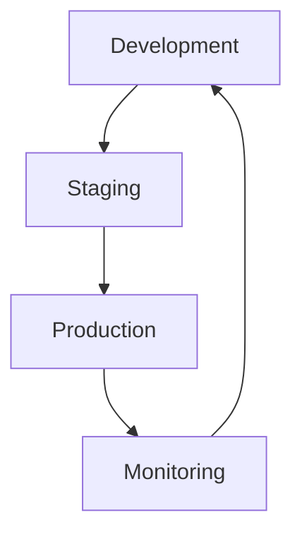

## Maintenance and Operations

### 1. Backup Strategy

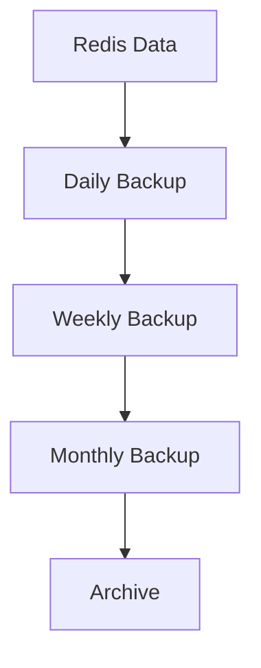

### 2. Update Strategy

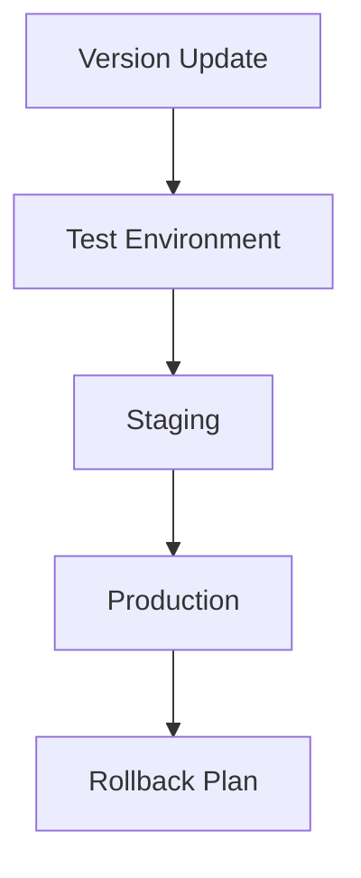

## Future Considerations

1. **Scalability Improvements**
   - Implement horizontal pod autoscaling
   - Add Redis cluster sharding
   - Optimize rate limit algorithms

2. **Monitoring Enhancements**
   - Add custom metrics
   - Implement detailed tracing
   - Enhance alerting rules

3. **Security Enhancements**
   - Implement OAuth2 integration
   - Add API key management
   - Enhance network policies

4. **Performance Optimizations**
   - Implement caching layers
   - Optimize database queries
   - Add connection pooling 