# Architecture Overview

## System Components

The Istio Rate Limiter Demo consists of the following key components:

1. **Istio Gateway**
   - Entry point for external traffic
   - Configured to accept HTTP traffic on port 80
   - Integrated with rate limiting and JWT authentication

2. **User Service**
   - Handles user management and authentication
   - Exposes REST API endpoints
   - Implements rate limiting based on user identity
   - Uses Redis for session storage

3. **Rate Limit Service**
   - Implements rate limiting logic
   - Uses Redis for rate limit storage
   - Communicates with Istio via gRPC
   - Supports multiple rate limiting strategies

4. **Redis**
   - Stores rate limit counters
   - Manages user sessions
   - Provides data persistence

5. **Monitoring Stack**
   - Prometheus for metrics collection
   - Grafana for visualization
   - Custom dashboards for rate limiting metrics

## Data Flow

1. **Request Flow**
   ```
   Client -> Istio Gateway -> Rate Limit Filter -> Rate Limit Service -> JWT Filter -> User Service
   ```

2. **Rate Limiting Flow**
   ```
   Request -> Rate Limit Filter -> Rate Limit Service -> Redis -> Response (Allow/Deny)
   ```

3. **Authentication Flow**
   ```
   Request -> JWT Filter -> User Service -> Redis -> Response
   ```

## Rate Limiting Strategies

1. **IP-based Rate Limiting**
   - Limits requests based on client IP
   - Configurable limits per IP address
   - Redis-backed counter storage

2. **User-based Rate Limiting**
   - Limits requests based on user identity
   - JWT token validation
   - Different limits for different user tiers

3. **Company-based Rate Limiting**
   - Limits requests based on company ID
   - JWT token validation
   - Shared limits for company users

## Monitoring and Metrics

1. **Key Metrics**
   - Request rates and latencies
   - Rate limit hits and rejections
   - Service health and errors
   - Resource utilization

2. **Dashboards**
   - Rate limiting overview
   - Service performance
   - Error rates and types
   - Resource usage

## Configuration Management

1. **Kubernetes Resources**
   - Gateway configuration
   - Virtual service routing
   - Rate limit filters
   - Service deployments

2. **Environment Variables**
   - Service configuration
   - Rate limit settings
   - Redis connection
   - Monitoring setup

## Security

1. **Authentication**
   - JWT token validation
   - Secure session management
   - Redis-backed session storage

2. **Rate Limiting**
   - Protection against DDoS
   - Fair usage policies
   - Configurable limits

## Load Testing

1. **Load Test Configuration**
   - Configurable request rates
   - Multiple concurrent workers
   - Metrics collection
   - Automatic gateway detection

2. **Test Scenarios**
   - Basic rate limiting
   - Authentication flows
   - Error handling
   - Performance testing

## Deployment

1. **Kubernetes Deployment**
   - Service mesh configuration
   - Resource allocation
   - Health checks
   - Scaling policies

2. **Monitoring Setup**
   - Prometheus configuration
   - Grafana dashboards
   - Alert rules
   - Log aggregation

## High-Level Architecture

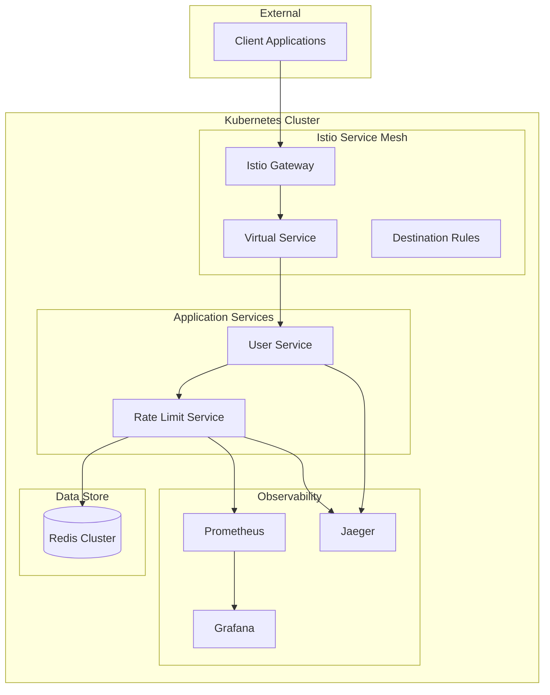

## Component Details

### 1. Istio Service Mesh Layer

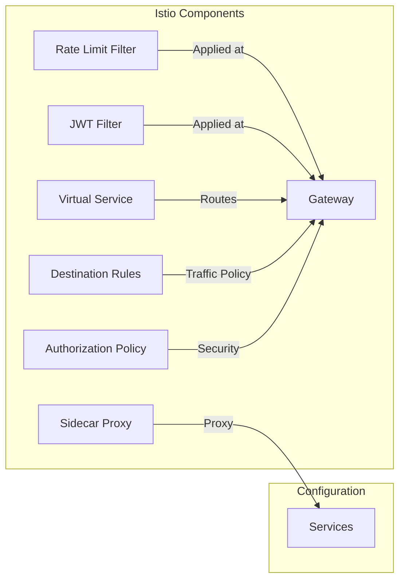

#### Key Components:
- **Istio Gateway**: Entry point for external traffic
- **Rate Limit Filter**: Enforces rate limits at the gateway level
- **JWT Filter**: Validates JWT tokens at the gateway level
- **Virtual Service**: Traffic routing rules
- **Destination Rules**: Traffic policies
- **Authorization Policy**: Security rules
- **Sidecar Proxy**: Request/response handling

### 2. Application Services

#### User Service
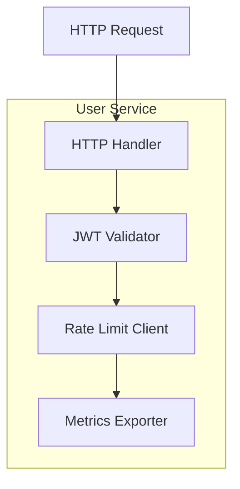

#### Rate Limit Service
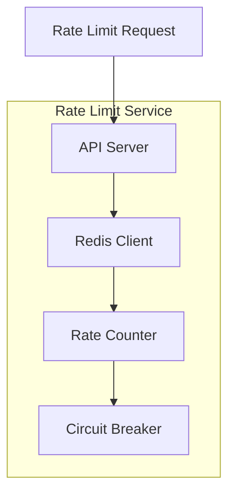

### 3. Data Flow

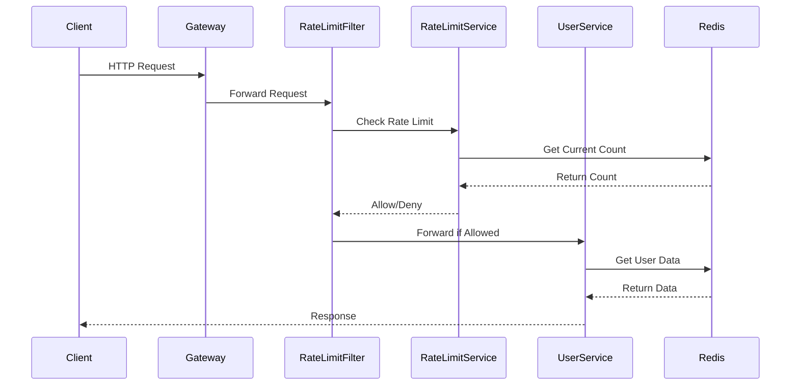

## Technical Specifications

### 1. Service Mesh Configuration

#### Gateway Configuration
```yaml
apiVersion: networking.istio.io/v1alpha3
kind: Gateway
metadata:
  name: user-service-gateway
spec:
  selector:
    istio: ingressgateway
  servers:
  - port:
      number: 80
      name: http
      protocol: HTTP
    hosts:
    - "*"
```

#### Virtual Service Configuration
```yaml
apiVersion: networking.istio.io/v1alpha3
kind: VirtualService
metadata:
  name: user-service-vs
spec:
  hosts:
  - "*"
  gateways:
  - user-service-gateway
  http:
  - route:
    - destination:
        host: user-service
        port:
          number: 8080
```

### 2. Rate Limiting Implementation

#### Rate Limit Algorithm
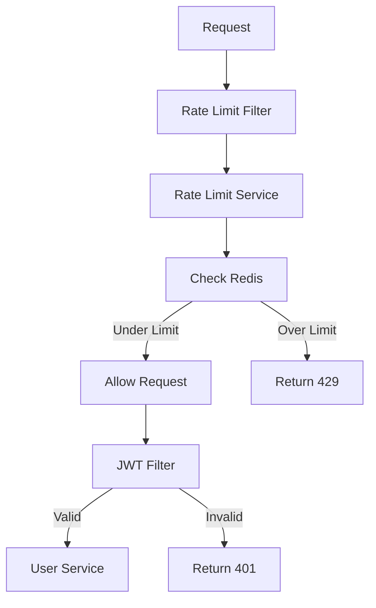

### 3. Monitoring Architecture

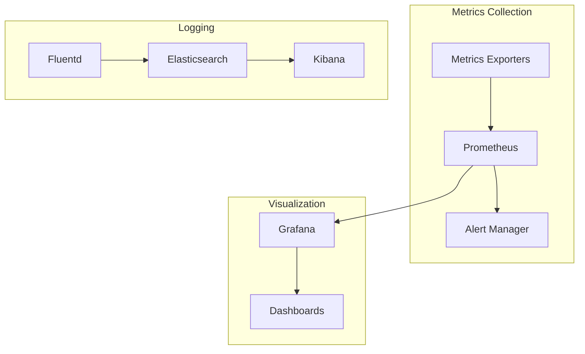

## Security Architecture

### 1. Authentication Flow

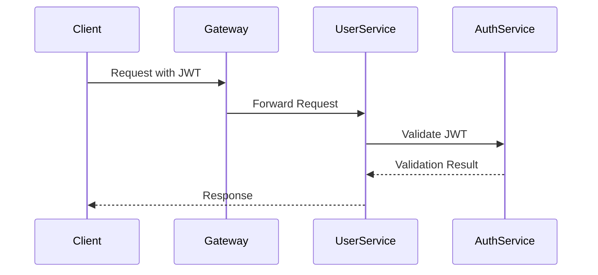

### 2. Network Security

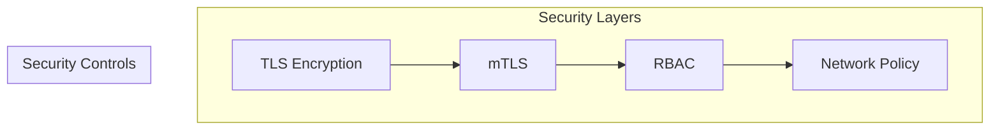

## Deployment Architecture

### 1. Kubernetes Resources

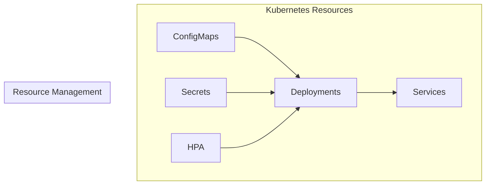

### 2. Scaling Strategy

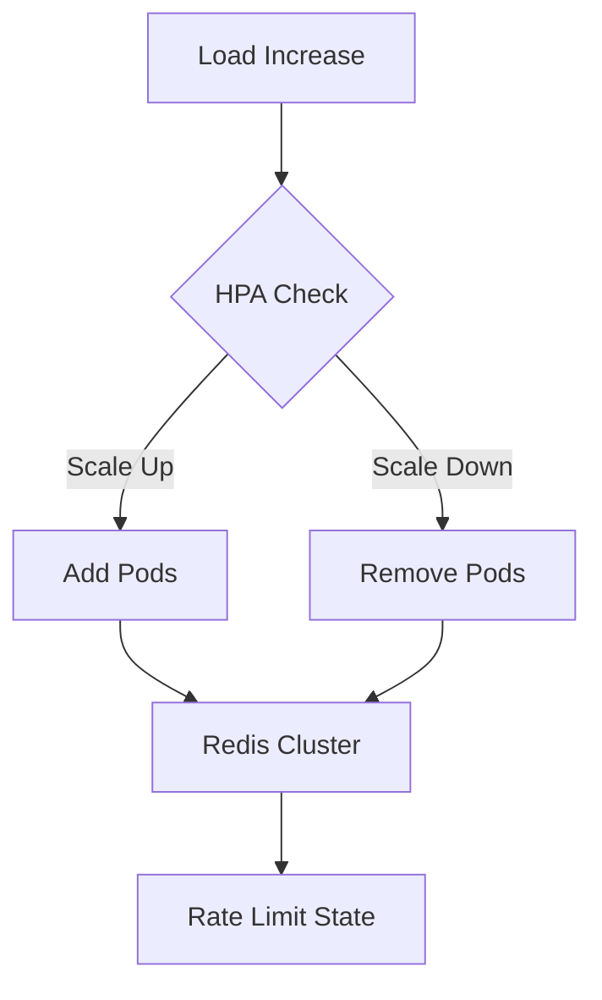

## Performance Considerations

### 1. Resource Requirements

| Component | CPU | Memory | Storage |
|-----------|-----|---------|----------|
| User Service | 0.5 CPU | 512Mi | N/A |
| Rate Limit Service | 1 CPU | 1Gi | N/A |
| Redis Cluster | 2 CPU | 2Gi | 10Gi |
| Prometheus | 1 CPU | 2Gi | 50Gi |
| Grafana | 0.5 CPU | 512Mi | 5Gi |

### 2. Performance Metrics

- Request Latency: < 100ms (P95)
- Rate Limit Checks: < 10ms
- Redis Operations: < 5ms
- JWT Validation: < 2ms

## High Availability

### 1. Component Redundancy

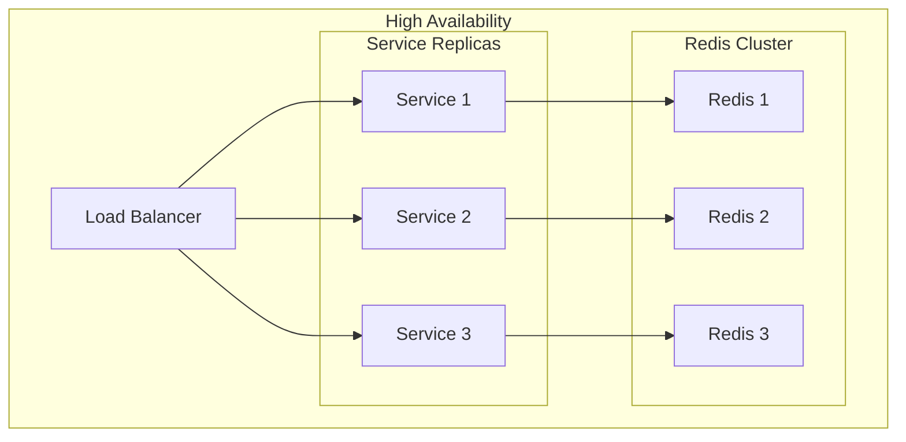

### 2. Failure Scenarios

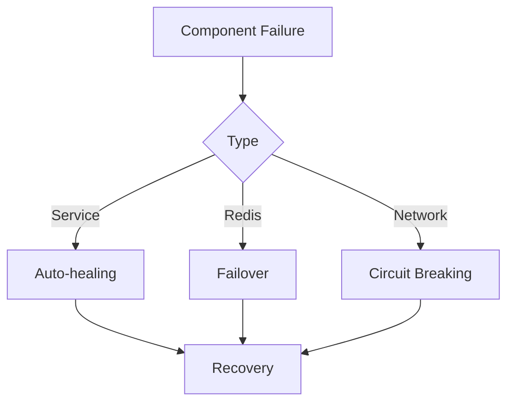

## Development Workflow

### 1. CI/CD Pipeline

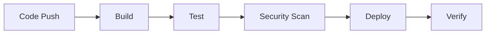

### 2. Environment Strategy

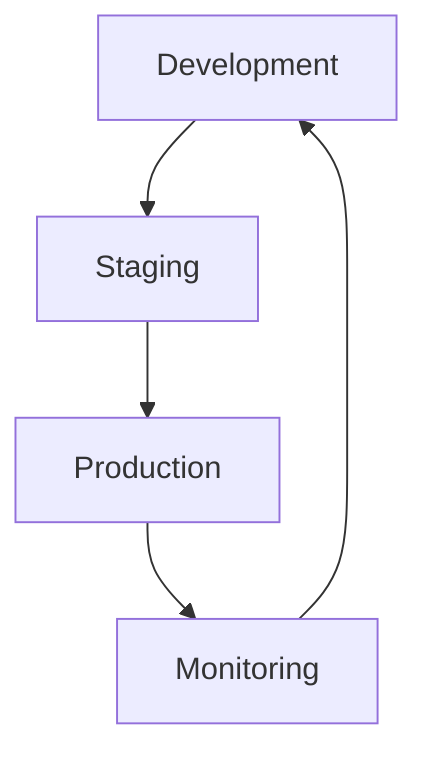

## Maintenance and Operations

### 1. Backup Strategy

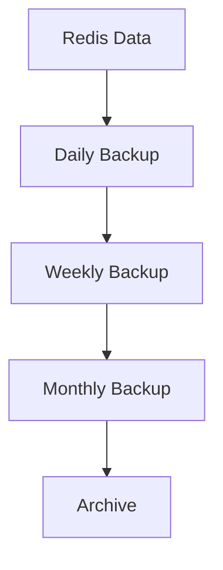

### 2. Update Strategy

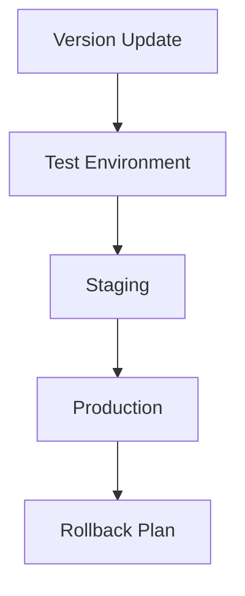

## Future Considerations

1. **Scalability Improvements**
   - Implement horizontal pod autoscaling
   - Add Redis cluster sharding
   - Optimize rate limit algorithms

2. **Monitoring Enhancements**
   - Add custom metrics
   - Implement detailed tracing
   - Enhance alerting rules

3. **Security Enhancements**
   - Implement OAuth2 integration
   - Add API key management
   - Enhance network policies

4. **Performance Optimizations**
   - Implement caching layers
   - Optimize database queries
   - Add connection pooling 