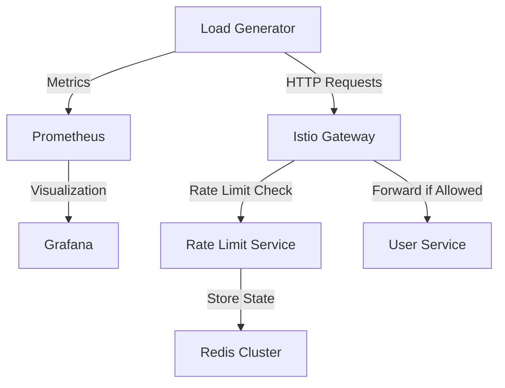

# Load Testing Guide

## Overview

The load testing suite is designed to test the rate limiting functionality of the system under various conditions. It includes tools for generating traffic, collecting metrics, and analyzing results.

## Prerequisites

1. **Kubernetes Cluster**
   - Istio installed and configured
   - All services deployed
   - Access to cluster configuration

2. **Required Tools**
   - `kubectl` configured
   - Go 1.16 or later
   - Access to cluster metrics

## Running Load Tests

### Using the Helper Script

The easiest way to run load tests is using the provided helper script:

```bash
./run-loadtest.sh
```

This script will:
1. Detect the external IP of the Istio ingress gateway
2. Set up port forwarding if needed
3. Build and run the load test
4. Clean up resources when done

### Manual Setup

If you prefer to run tests manually:

1. **Get the Gateway IP**
   ```bash
   kubectl get svc -n istio-system istio-ingressgateway -o jsonpath='{.status.loadBalancer.ingress[0].ip}'
   ```

2. **Set up Port Forwarding** (if needed)
   ```bash
   kubectl port-forward -n istio-system svc/istio-ingressgateway 8080:80
   ```

3. **Build and Run**
   ```bash
   cd loadtest
   go build -o loadtest
   ./loadtest -url "http://<GATEWAY_IP>" -rps 100 -duration 5m -concurrency 10
   ```

## Test Parameters

The load test supports the following parameters:

- `-url`: Target URL (default: http://localhost:8083)
- `-rps`: Requests per second (default: 100)
- `-duration`: Test duration (default: 5m)
- `-concurrency`: Number of concurrent workers (default: 10)
- `-metrics`: Enable Prometheus metrics (default: true)
- `-metrics-port`: Metrics port (default: 9090)

## Test Scenarios

### 1. Basic Rate Limiting

Tests the basic rate limiting functionality:
```bash
./loadtest -url "$EXTERNAL_IP" -rps 50 -duration 1m
```

### 2. Authentication Flow

Tests authenticated endpoints with JWT tokens:
```bash
./loadtest -url "$EXTERNAL_IP" -rps 30 -duration 2m -auth
```

### 3. High Load

Tests system behavior under high load:
```bash
./loadtest -url "$EXTERNAL_IP" -rps 200 -duration 3m -concurrency 20
```

### 4. Error Handling

Tests error scenarios and recovery:
```bash
./loadtest -url "$EXTERNAL_IP" -rps 100 -duration 1m -error-rate 0.1
```

## Monitoring Tests

### Prometheus Metrics

The load test exposes Prometheus metrics at `:9090/metrics`:
- Request rates
- Response times
- Error counts
- Rate limit hits

### Grafana Dashboard

A pre-configured dashboard is available for visualizing test results:
- Request rates over time
- Response time percentiles
- Error rates
- Rate limit rejections

## Analyzing Results

### Key Metrics

1. **Request Rates**
   - Successful requests per second
   - Failed requests per second
   - Rate limit hits

2. **Response Times**
   - P50 latency
   - P95 latency
   - P99 latency

3. **Error Rates**
   - Rate limit rejections
   - Authentication failures
   - System errors

### Performance Criteria

The system should maintain:
- Response time < 100ms (P95)
- Error rate < 1%
- Successful rate limit enforcement

## Troubleshooting

### Common Issues

1. **Gateway Not Accessible**
   - Check Istio ingress gateway status
   - Verify port forwarding
   - Check network policies

2. **High Error Rates**
   - Check service logs
   - Verify rate limit configuration
   - Monitor resource usage

3. **Metrics Not Available**
   - Check Prometheus configuration
   - Verify service mesh setup
   - Check metric endpoints

### Debugging Tools

1. **Service Logs**
   ```bash
   kubectl logs -l app=user-service
   kubectl logs -l app=ratelimit
   ```

2. **Metrics**
   ```bash
   kubectl port-forward svc/prometheus 9090:9090
   ```

3. **Configuration**
   ```bash
   kubectl get gateway,virtualservice,envoyfilter
   ```

## Load Testing Architecture



## Test Configuration

### 1. Load Test Parameters

```yaml
# loadtest/config.yaml
scenarios:
  basic:
    duration: 5m
    rps: 100
    concurrency: 10
  
  rate_limit:
    duration: 10m
    companies:
      - name: company1
        limit: 100
      - name: company2
        limit: 50
    ip_ranges:
      - 192.168.1.0/24
      - 10.0.0.0/16
  
  mixed:
    duration: 15m
    distribution:
      normal: 70%
      burst: 20%
      slow: 10%
```

### 2. JWT Configuration

```yaml
# loadtest/jwt-config.yaml
jwt:
  secret: your-secret-key
  issuer: your-issuer
  expiry: 1h
  claims:
    - company_id
    - role
    - permissions
```

## Metrics Collection

### 1. Request Metrics

```prometheus
# Request counters
loadtest_requests_total{status="success"}
loadtest_requests_total{status="rate_limited"}
loadtest_requests_total{status="error"}

# Latency metrics
loadtest_request_duration_seconds{quantile="0.95"}
loadtest_request_duration_seconds{quantile="0.99"}
```

### 2. Rate Limit Metrics

```prometheus
# Rate limit metrics
loadtest_rate_limits_hit_total{company="company1"}
loadtest_rate_limits_hit_total{ip="192.168.1.1"}
loadtest_rate_limits_remaining{company="company1"}
```

## Results Analysis

### 1. Performance Metrics

```go
type TestResults struct {
    TotalRequests      int64
    SuccessfulRequests int64
    RateLimitedRequests int64
    ErrorRequests      int64
    
    Latencies struct {
        Min    time.Duration
        Max    time.Duration
        Mean   time.Duration
        P95    time.Duration
        P99    time.Duration
    }
    
    RPS struct {
        Target  float64
        Actual  float64
        Limited float64
    }
}
```

### 2. Visualization

```json
// Grafana dashboard configuration
{
  "dashboard": {
    "panels": [
      {
        "title": "Requests per Second",
        "type": "graph",
        "targets": [
          {
            "expr": "rate(loadtest_requests_total[1m])",
            "legendFormat": "{{status}}"
          }
        ]
      },
      {
        "title": "Response Time Distribution",
        "type": "heatmap",
        "targets": [
          {
            "expr": "rate(loadtest_request_duration_seconds_bucket[1m])"
          }
        ]
      }
    ]
  }
}
```

## Performance Tuning

### 1. System Tuning

```bash
# Tune system limits
sysctl -w net.ipv4.ip_local_port_range="1024 65535"
sysctl -w net.core.somaxconn=65535
sysctl -w net.ipv4.tcp_max_syn_backlog=65535

# Tune ulimits
ulimit -n 65535
```

### 2. Kubernetes Tuning

```yaml
# Pod resource configuration
resources:
  requests:
    cpu: 1
    memory: 1Gi
  limits:
    cpu: 2
```

## For more information on performance considerations, see the [Rate Limiting](04-rate-limiting.md) and [Monitoring](07-monitoring.md) documentation. 