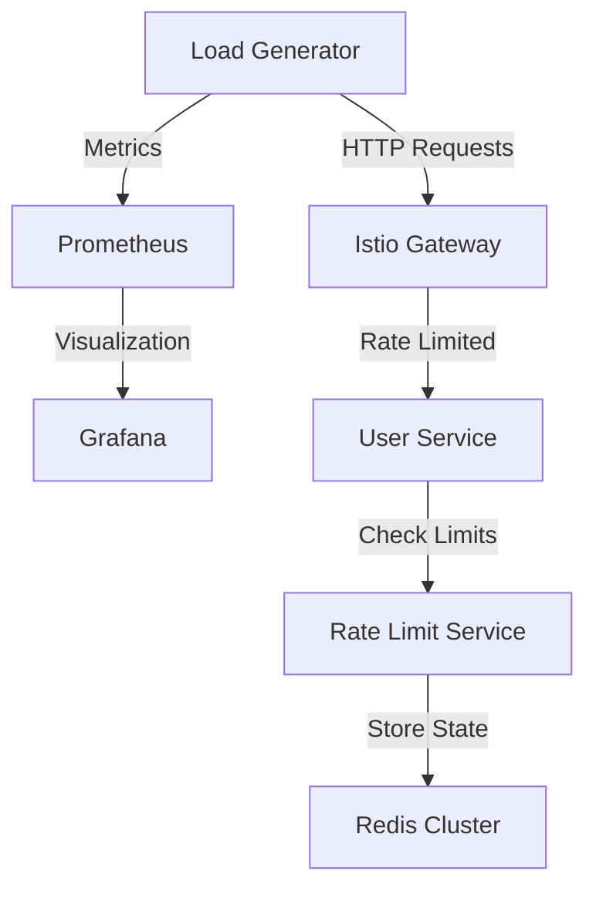

# Load Testing Guide

## Overview

This guide covers load testing the rate-limited service using the provided load testing tools:
- Test scenarios
- Tool configuration
- Results analysis
- Performance tuning

## Load Testing Architecture



## Test Scenarios

### 1. Basic Load Test

```go
// Basic load test configuration
type Config struct {
    URL         string        // Target URL
    Duration    time.Duration // Test duration
    Concurrency int          // Number of concurrent users
    RPS         int          // Requests per second
}

// Example usage
config := Config{
    URL:         "http://gateway-url/users",
    Duration:    5 * time.Minute,
    Concurrency: 10,
    RPS:         100,
}
```

### 2. Rate Limit Test

```go
// Rate limit test configuration
type RateLimitConfig struct {
    Companies     []string      // List of company IDs
    RequestsPerIP int          // IP-based limit
    TokenDuration time.Duration // JWT token duration
}

// Example usage
config := RateLimitConfig{
    Companies:     []string{"company1", "company2", "company3"},
    RequestsPerIP: 30,
    TokenDuration: time.Minute,
}
```

## Running Tests

### 1. Basic Load Test

```bash
# Run basic load test
go run loadtest/main.go \
  --url http://$GATEWAY_URL/users \
  --duration 5m \
  --concurrency 10 \
  --rps 100
```

### 2. Rate Limit Test

```bash
# Run rate limit test
go run loadtest/main.go \
  --url http://$GATEWAY_URL/users \
  --duration 5m \
  --companies company1,company2,company3 \
  --ip-limit 30 \
  --company-limit 100
```

### 3. Mixed Load Test

```bash
# Run mixed load test
go run loadtest/main.go \
  --url http://$GATEWAY_URL/users \
  --duration 10m \
  --scenario mixed \
  --distribution "70,20,10" \
  --jwt-enabled
```

## Test Configuration

### 1. Load Test Parameters

```yaml
# loadtest/config.yaml
scenarios:
  basic:
    duration: 5m
    rps: 100
    concurrency: 10
  
  rate_limit:
    duration: 10m
    companies:
      - name: company1
        limit: 100
      - name: company2
        limit: 50
    ip_ranges:
      - 192.168.1.0/24
      - 10.0.0.0/16
  
  mixed:
    duration: 15m
    distribution:
      normal: 70%
      burst: 20%
      slow: 10%
```

### 2. JWT Configuration

```yaml
# loadtest/jwt-config.yaml
jwt:
  secret: your-secret-key
  issuer: your-issuer
  expiry: 1h
  claims:
    - company_id
    - role
    - permissions
```

## Metrics Collection

### 1. Request Metrics

```prometheus
# Request counters
loadtest_requests_total{status="success"}
loadtest_requests_total{status="rate_limited"}
loadtest_requests_total{status="error"}

# Latency metrics
loadtest_request_duration_seconds{quantile="0.95"}
loadtest_request_duration_seconds{quantile="0.99"}
```

### 2. Rate Limit Metrics

```prometheus
# Rate limit metrics
loadtest_rate_limits_hit_total{company="company1"}
loadtest_rate_limits_hit_total{ip="192.168.1.1"}
loadtest_rate_limits_remaining{company="company1"}
```

## Results Analysis

### 1. Performance Metrics

```go
type TestResults struct {
    TotalRequests      int64
    SuccessfulRequests int64
    RateLimitedRequests int64
    ErrorRequests      int64
    
    Latencies struct {
        Min    time.Duration
        Max    time.Duration
        Mean   time.Duration
        P95    time.Duration
        P99    time.Duration
    }
    
    RPS struct {
        Target  float64
        Actual  float64
        Limited float64
    }
}
```

### 2. Visualization

```json
// Grafana dashboard configuration
{
  "dashboard": {
    "panels": [
      {
        "title": "Requests per Second",
        "type": "graph",
        "targets": [
          {
            "expr": "rate(loadtest_requests_total[1m])",
            "legendFormat": "{{status}}"
          }
        ]
      },
      {
        "title": "Response Time Distribution",
        "type": "heatmap",
        "targets": [
          {
            "expr": "rate(loadtest_request_duration_seconds_bucket[1m])"
          }
        ]
      }
    ]
  }
}
```

## Performance Tuning

### 1. System Tuning

```bash
# Tune system limits
sysctl -w net.ipv4.ip_local_port_range="1024 65535"
sysctl -w net.core.somaxconn=65535
sysctl -w net.ipv4.tcp_max_syn_backlog=65535

# Tune ulimits
ulimit -n 65535
```

### 2. Kubernetes Tuning

```yaml
# Pod resource configuration
resources:
  requests:
    cpu: 1
    memory: 1Gi
  limits:
    cpu: 2
```

## For more information on performance considerations, see the [Rate Limiting](04-rate-limiting.md) and [Monitoring](07-monitoring.md) documentation. 