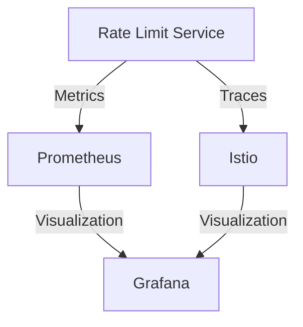

# Monitoring Guide

## Overview

This guide covers monitoring and observability for the rate-limited service:
- Metrics collection with Prometheus
- Visualization with Grafana
- Alerting
- Dashboards
- Troubleshooting

## Monitoring Architecture



## Metrics Collection

### 1. Prometheus Configuration

The Prometheus configuration is deployed as a ConfigMap in the `istio-system` namespace:

```yaml
# k8s/prometheus-config.yaml
apiVersion: v1
kind: ConfigMap
metadata:
  name: prometheus-config
  namespace: istio-system
data:
  prometheus.yml: |
    global:
      scrape_interval: 15s
      evaluation_interval: 15s

    scrape_configs:
      - job_name: 'rate-limit-service'
        static_configs:
          - targets: ['rate-limit-service:9090']
        metrics_path: '/metrics'

      - job_name: 'user-service'
        static_configs:
          - targets: ['user-service:8080']
        metrics_path: '/metrics'

      - job_name: 'istio-mesh'
        kubernetes_sd_configs:
          - role: pod
            namespaces:
              names:
                - istio-system
        relabel_configs:
          - source_labels: [__meta_kubernetes_pod_container_name]
            regex: istio-proxy
            action: keep
          - source_labels: [__meta_kubernetes_pod_container_port_number]
            regex: "15020"
            action: keep
        metric_relabel_configs:
          - source_labels: [__name__]
            regex: 'istio_.*'
            action: keep
```

### 2. Service Metrics

The rate limit service exposes the following metrics:

```go
// Rate limit service metrics
var (
    rateLimitRequests = promauto.NewCounterVec(
        prometheus.CounterOpts{
            Name: "rate_limit_requests_total",
            Help: "Total number of rate limit requests processed",
        },
        []string{"status", "type"},
    )

    rateLimitLatency = promauto.NewHistogramVec(
        prometheus.HistogramOpts{
            Name:    "rate_limit_latency_seconds",
            Help:    "Rate limit request latency in seconds",
            Buckets: prometheus.DefBuckets,
        },
        []string{"type"},
    )
)
```

## Grafana Visualization

### 1. Grafana Datasource

The Grafana datasource is configured automatically through a ConfigMap:

```yaml
# k8s/grafana-datasource.yaml
apiVersion: v1
kind: ConfigMap
metadata:
  name: grafana-datasources
  namespace: istio-system
data:
  prometheus.yaml: |
    apiVersion: 1
    datasources:
      - name: Prometheus
        type: prometheus
        url: http://prometheus:9090
        access: proxy
        isDefault: true
        editable: false
        version: 1
        jsonData:
          timeInterval: "15s"
```

### 2. Rate Limiter Dashboard

The dashboard includes four main panels:

1. **Rate Limit Requests Rate**
   - Time series graph showing request rates by status and type
   - Metrics: `rate(rate_limit_requests_total[5m])`
   - Legend format: `{{status}} - {{type}}`

2. **Rate Limit Latency**
   - 95th percentile latency graph
   - Metrics: `histogram_quantile(0.95, rate(rate_limit_latency_seconds_bucket[5m]))`
   - Units: seconds

3. **Rate Limit Hits Rate**
   - Gauge showing current hit rate
   - Metrics: `rate(rate_limit_hits_total[5m])`
   - Thresholds: Green < 80, Red >= 80

4. **Rate Limit Errors**
   - Time series graph showing error rates
   - Metrics: `rate(rate_limit_requests_total{status="error"}[5m])`

Dashboard features:
- Auto-refresh: 5 seconds
- Default time range: Last 1 hour
- Dark theme
- Legend placement: Bottom
- Tooltips: Single series

## Deployment

The monitoring stack is deployed using Kubernetes manifests:

```bash
# Apply configurations
kubectl apply -f k8s/prometheus-config.yaml
kubectl apply -f k8s/grafana-datasource.yaml
kubectl apply -f k8s/grafana-dashboard.yaml
kubectl apply -f k8s/monitoring.yaml

# Access Grafana
kubectl port-forward -n istio-system svc/grafana 3000:3000

# Access Prometheus
kubectl port-forward -n istio-system svc/prometheus 9090:9090
```

## Troubleshooting

### Common Issues

1. **Metrics Not Showing**
   - Check if Prometheus can reach the service endpoints
   - Verify service labels match scrape config
   - Check service metrics endpoint is responding

2. **Dashboard Not Loading**
   - Verify Grafana datasource is properly configured
   - Check Prometheus is accessible from Grafana
   - Verify dashboard JSON is valid

3. **High Latency**
   - Check service resource limits
   - Verify Redis connection
   - Monitor network latency between services

### Useful Queries

```promql
# Rate limit request rate by status
rate(rate_limit_requests_total[5m])

# 95th percentile latency
histogram_quantile(0.95, rate(rate_limit_latency_seconds_bucket[5m]))

# Error rate
rate(rate_limit_requests_total{status="error"}[5m])

# Hit rate
rate(rate_limit_hits_total[5m])
```

## Best Practices

1. **Metrics**
   - Use consistent naming conventions
   - Include relevant labels
   - Set appropriate scrape intervals
   - Use histograms for latency metrics

2. **Dashboards**
   - Keep panels focused and relevant
   - Use appropriate visualization types
   - Set meaningful thresholds
   - Include legends and tooltips

3. **Alerting**
   - Set realistic thresholds
   - Include meaningful descriptions
   - Use appropriate severity levels
   - Configure proper notification channels

## Next Steps

After setting up monitoring:
1. Validate metrics collection
2. Configure alerts
3. Test dashboard functionality
4. Proceed to [Troubleshooting Guide](08-troubleshooting.md) 